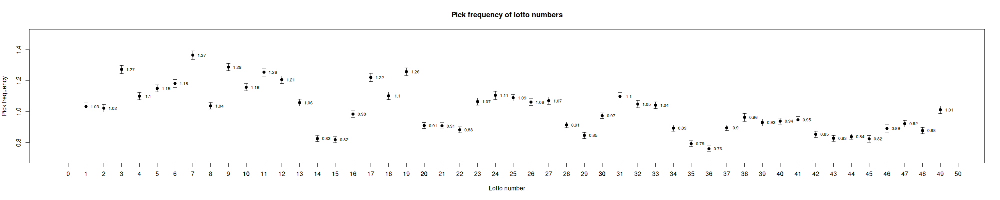
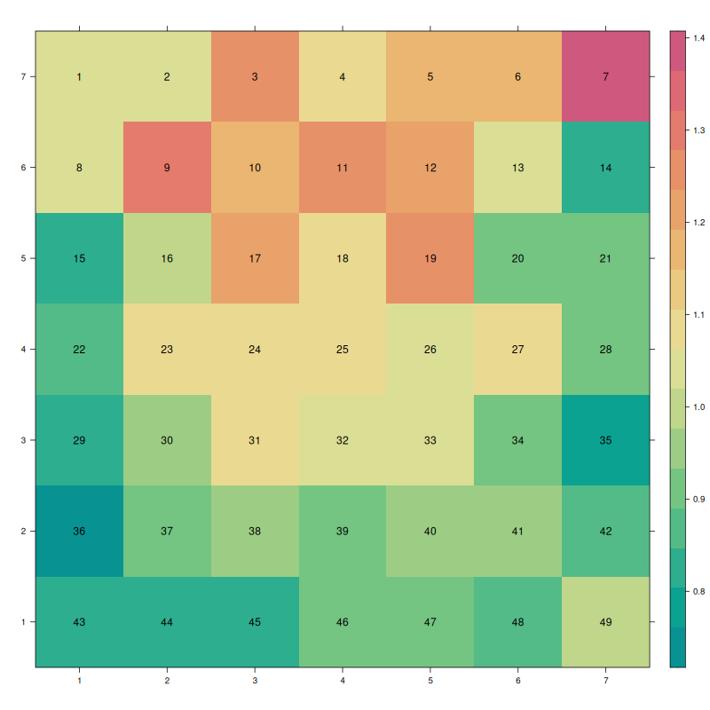

# Pick frequency analysis of German lottery numbers

This repository analyzes the pick frequency of lottery numbers in the German lottery. Some numbers are played more often by lottery players than others.
If rare numbers are picked, the lottery will pay out more money in the case of a winning ticket. This strategy does not increase the likelihood of winning,
but it maximizes possible payouts.

## Results

This graph shows the relative pick rate of German lottery numbers. A 1.0 means the number is picked as often as one would expect it to be. Higher numbers
indicate that the number is picked more often than it would if numbers were picked randomly; e.g. a 1.3 means that the respective number is picked 30% more
often than it would be if it was picked randomly.

The same data is visualized here in a heat map:

The heatmap is shaped like a lottery ticket. The numbers are colored according to the relative pick rate; red indicates a high pick rate,
green indicates a low pick rate. As can be seen from this visualization, numbers in the middle and at the top of the ticket are picked more often than
numbers at the edge (with exceptions like the number 7).

For the super numbers see the following graph:

Special numbers are picked as one would expect: 7 is by far the most commonly picked number and 0 the least.

## Updates

This repository automatically updates the pick frequency analysis every day. So come back tomorrow to see the latest results.
